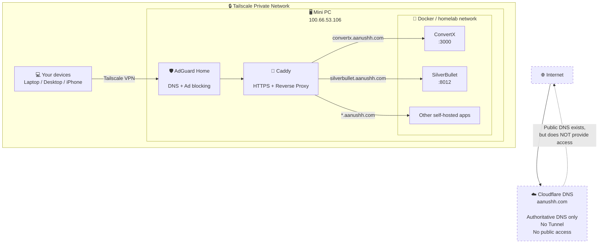

# self-hosted

A space to hold all the configs for my self-hosted apps.

## List of my self-hosted apps

- [Silverbullet](https://github.com/silverbulletmd/silverbullet)

## Architecture

```mermaid
flowchart TB
    Internet["🌐 Internet"]

    CF["☁️ Cloudflare DNS<br/>aanushh.com<br/><br/>Authoritative DNS only<br/>No Tunnel<br/>No public access"]

    Internet --> CF

    subgraph Tailnet["🔒 Tailscale Private Network"]
        Device["💻 Your devices<br/>Laptop / Desktop / iPhone"]

        subgraph MiniPC["🖥️ Mini PC<br/>100.66.53.106"]
            AG["🛡️ AdGuard Home<br/><br/>DNS + Ad blocking"]

            Caddy["🔀 Caddy<br/><br/>HTTPS + Reverse Proxy"]

            subgraph Docker["🐳 Docker / homelab network"]
                ConvertX["ConvertX<br/>:3000"]
                SilverBullet["SilverBullet<br/>:8012"]
                Future["Other self-hosted apps"]
            end

            AG --> Caddy

            Caddy -->|"convertx.aanushh.com"| ConvertX
            Caddy -->|"silverbullet.aanushh.com"| SilverBullet
            Caddy -->|"*.aanushh.com"| Future
        end

        Device -->|"Tailscale VPN"| AG
    end

    CF -. "Public DNS exists,<br/>but does NOT provide access" .-> Internet

    style Internet stroke-dasharray: 5 5
    style CF stroke-dasharray: 5 5
```
