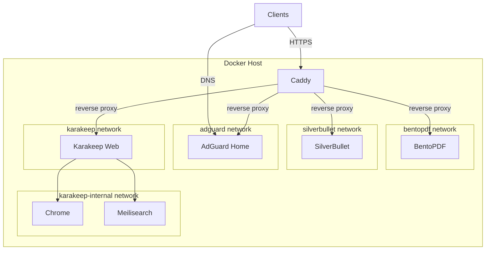

# self-hosted

Dictionary of my self-hosted apps.

## List of my self-hosted apps

- [AdGuard](https://adguard.com/en/welcome.html) - DNS & Ad Blocker for my Home Lab
- [Caddy](https://caddyserver.com/) - Proxy server for my Home Lab
- [Karakeep](https://karakeep.app/) - Organize my bookmarks
- [Silverbullet](https://silverbullet.md/) - Personal knowledge base
- [BentoPDf](https://www.bentopdf.com/docs/) - PDF manipulation tool

## Architecture

